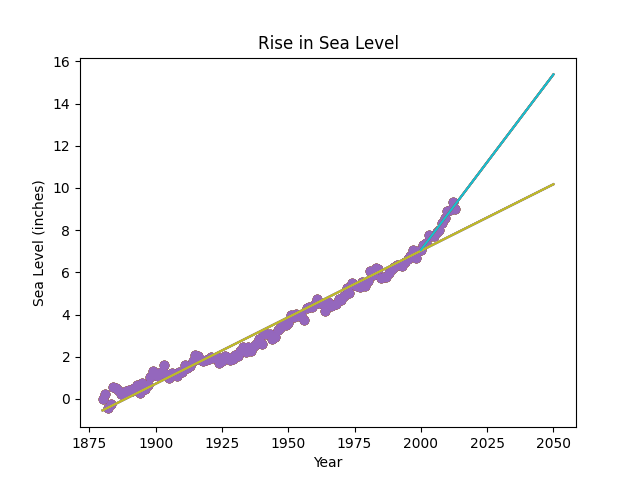

# FCC_Sea_Level_Predictor
Sea Level Predictor Project for FCC Data Analysis with Python Certification

## Run Locally

1. Clone the project

```bash
  git clone https://github.com/sameeksha15/FCC_Sea_Level_Predictor.git
```

2. Go to the project directory

```bash
  cd FCC_Sea_Level_Predictor
```

3. Create virtual environment 

```bash
  python -m venv venv
```

4. Activate virtual environment

- For Windows
```bash
  .\venv\Scripts\activate
```

- For Unix
```bash
  ./venv/bin/activate
```

5. Install dependencies

```bash
  pip install -r requirements.txt
```

6. Run the script

```bash
  python main.py
```
## Dataset

|index|Year|CSIRO Adjusted Sea Level|Lower Error Bound|Upper Error Bound|NOAA Adjusted Sea Level|
|---|---|---|---|---|---|
|0|1880|0\.0|-0\.952755905|0\.952755905|NaN|
|1|1881|0\.220472441|-0\.732283464|1\.173228345|NaN|
|2|1882|-0\.440944881|-1\.346456692|0\.464566929|NaN|
|3|1883|-0\.232283464|-1\.129921259|0\.66535433|NaN|
|4|1884|0\.590551181|-0\.283464567|1\.464566928|NaN|

<br/>

## OUTPUT 

- Plot for "Rise in Sea Level"
<br/>

[]()

